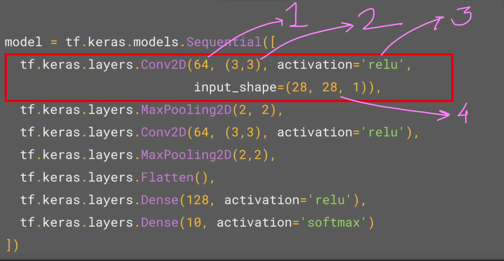
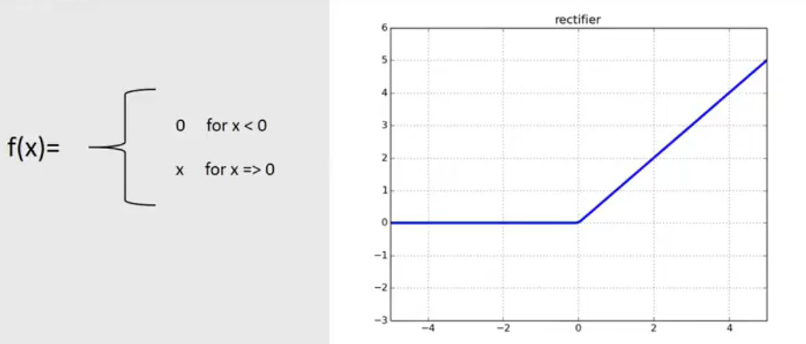
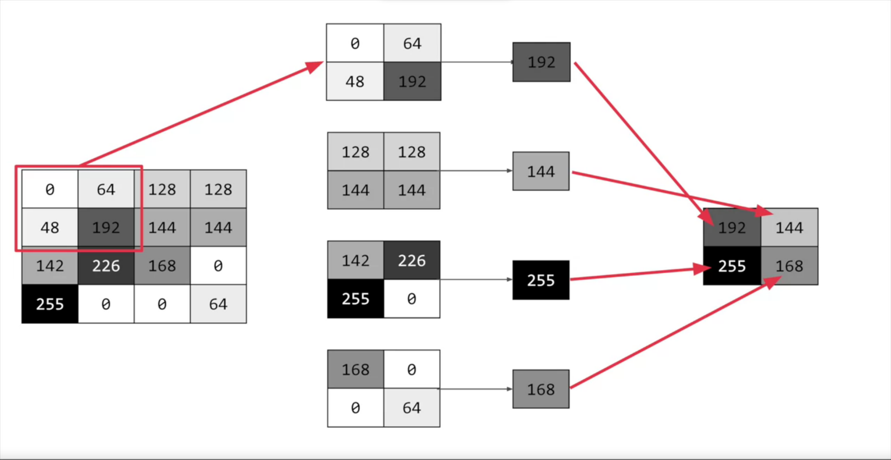
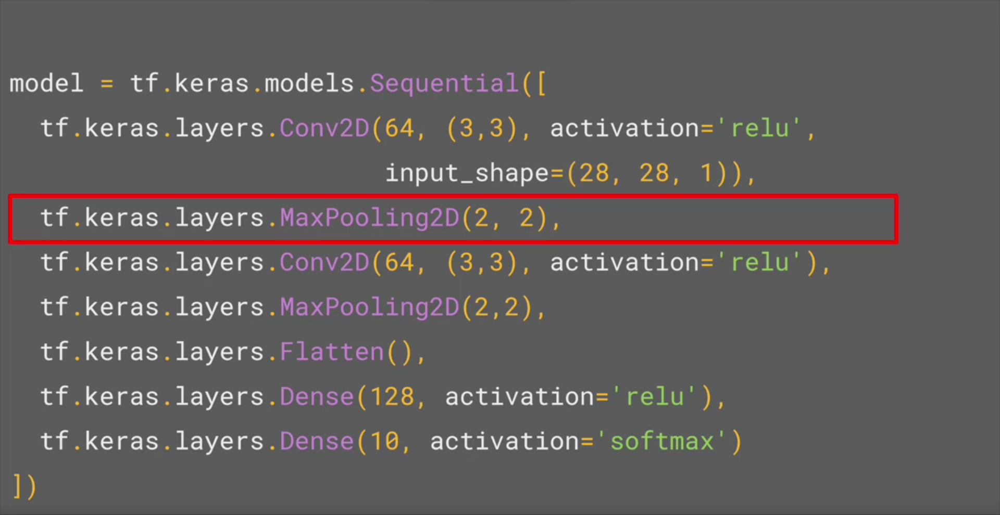

 ## CNN

 Convolutional Neural Network add a filter to the main image to emphasize the main image.

 E.g:
 

 In the above image, 
 
 1. `64` represents no. of convolutions (filters).
 2. `(3,3)` represents the shape of the convolution.
 3. `ReLu` is the activation function.
 4. `28x28` is the shape of input image and `1` is 1 byte color depth. 

 ## Activation function

 Relu Function Eliminates the negative values

e.g:

 

 ## Optimizer

 the loss function measures the guess how good or bad it is and then the loss fn gives the guess to the optimizer which predicts the next guess amd the logic is each guess should get better and better than before.

 ## Pooling 

 Pooling is technique to reduce the information in an image while maintaining features. Pooling is powerfull tool to compress image, it basically divides the matrix into the set of 4 parts and takes the maximum value (in maxpooling) from each quater, this helps in preserving the best feature as well as quartering the size of an image.

 __Eg 1:__

 

 __E.g 2:__

In the above image, `MaxPooling2D(2,2)` represents the maximum pixel value will be selected from the 2x2 pooled matrix. 

